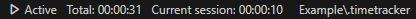
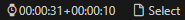

# **Time Tracker**
The Time Tracker extension will track your time spent coding in **Visual Studio Code**. Just start it at the beginning of a work session using `Ctrl+Shift+P` and selecting `Time Tracker:Start`.

All of your time tracking sessions are saved in a `.timetracker` file. You can push it to your project's GIT repo along with your code to sync your activity across all your devices.

By default, Time Tracker will stop counting time after 2 minutes of inactivity and will move to the `Paused` state. Just begin editing code, switch editor tabs, or open files and Time Tracker will resume.

Time of inactivity can be changed in the extension's settings (see below).

## **Appearance variants**

Time Tracker visualizes its work on the status bar. There are two modes awailable for choosing.

#### **Wide mode**
In this mode, the status panel looks as shown in the picture below:

Wide mode provides the following information:

* Activity states
    * `Active` - The Time Tracker is active and counting time.
    * `Inactive` - The Time Tracker is stopped and not counting time. It will not resume after editing or opening a file.
    * `Paused` - The Time Tracker is paused and not counting time. It will resume when you begin activity again.
* Total time: The sum of all sessions spent on this project
* Current session time: The time since the last pause or since `Time tracking:Start` performing.
* Current time tracker file: The active file where time tracking data is being stored.

### **Compact mode**

If you prefer a more compact interface, you can enable `Use Compact Panel` in the extension's settings. In this case, the status panel will look as shown below:

In this mode, a small watch icon indicates that time tracking is either currently active or paused. When stopped, no icon is displayed.

The time tracker file select is abbreviated with a small file icon with the text Select. You can hover over the status bar item to see the currently selected file for time tracking.

## **Activation / Deactivation**

#### **Using the mouse**
Click on the status panel to begin a time tracking session and then click again to end it.

Click the file select panel to choose which file to use to store your time tracking data.

#### **Using commands**

Use `Ctrl+Shift+P` to execute Time Tracker commands.
* `Time Tracker: Start` - Activate time tracking
* `Time Tracker: Pause` - Pause time tracking
* `Time Tracker: Stop` - Deactivate time tracking
* `Time Tracker: Recompute` - Recompute total tracked time
* `Time Tracker: Select Time Tracker File` - Choose active time tracker file

## **Configuration**

At this time, the following configuration options are available:

**Startup behavior configuration:**

* `timetracker.autostart.autoStartTimeTracking` - Automatically start time tracking when the project (folder) is opened and a `.timetracker` file already exists in the project's folder.
* `timetracker.autostart.autoCreateTimeTrackingFile` - Automatically start time tracking and create a `.timetracker` file if it does not exist yet.
* `timetracker.autostart.askAboutAutoStart` - Ask user before automatically start time tracking.

**Auto-pause behavior**
* `timetracker.pauseAfter` - Time in seconds before the tracker will be paused. If set to 0 (zero) then auto pause will be disabled.

**Appearance**
* `timetracker.useCompactStatusPanel` - Use compact mode of the status bar. The default is false.
* `timetracker.dotTimeTrackerIndent` - Indentation of `.timetracker` file. If set to a number, it indicates the number of space characters to use as indentation. If set to a string, the string is used as indentation.

You can set these options via `File` -> `Preferences` -> `Settings`.

